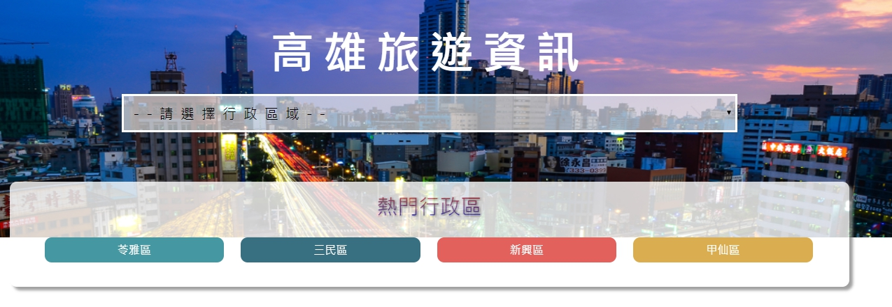
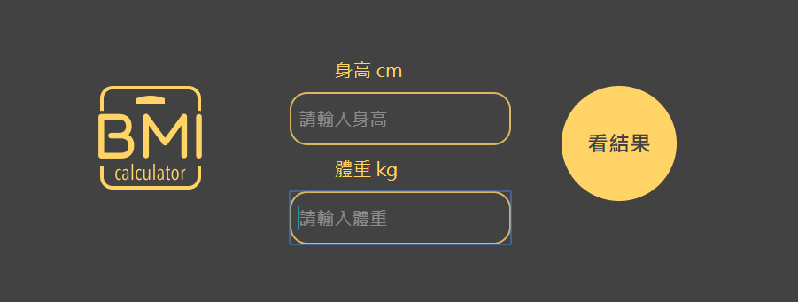

# 陳世勛 (Joe Chen) 
- Birthday: 1993/07/30
- Education:景文科技大學 / 電子工程系
- Location: Taipei City
- E-mail: yes852956@gmail.com
- Mobile: 0937-791-264

### 專業技能
- 熟悉 HTML5 : 熟悉應用HTML標籤 熟悉如何切版且不依賴Bootstrap切出客戶需求的頁面
- 熟悉 css3  : 熟悉排版 了解如何正確使用display(flex、position、z-index、box-model),懂得權重,懂並且基本應用 pseudo element
- 響應式網頁(RWD) : 熟悉並可以不依賴套件 設計手機、平板、桌電適用的網頁
- 了解 Javascript 基本語法，並使用 Jquery / CSS3 呈現網頁動態效果。
- 利用 AJAX 撈取遠端JSON資料並顯示在網頁上
- 使用 Bootstrap 快速開發響應式網頁。
- 使用過 gulp 提高網頁載入效率。
- 使用過基礎指令 Git / Github 做版本控制
⌞ 使用過 Git GUI/sourcetree 圖形化介面做版本控制
- 使用 photoshop 進行視覺流程製作，並將圖檔壓縮及改為SVG，提高載入效率。
- 使用過多種plugin 搭配網頁達到多種特效 加速網頁開發
* 基礎了解SEO搜尋引擎優化；建立有效率且易維護的程式碼；基礎了解相容性；有良好習慣性的註解以便維護及修改

### 工作經驗 
-  工作期間 2012/2017 全家便利商店 /  直營店 職位:副店長  
-  工作期間 2014/2015 麥當勞 /  直營店 職位實習組長    

### 作品集 
- <a href="https://joechen0730.github.io/trval/" target="blank"><B>高雄旅遊資訊</B> (RWD)</a>  
  <a href="https://joechen0730.github.io/trval/" target="blank"> </a>  
  
  ⌞ 建立三種大眾常用的響應式網頁(手機、平板、桌電)   
  ⌞ 透過AJAX技術抓取 JSON 資料，並透過選取或點擊方式，將客戶選擇的地區渲染在網頁上。 
  ⌞ 做出詳細資料框，將你所點選的地區的資料透過Ajax抓取資料完整後顯示。 

- <a href="https://joechen0730.github.io/trvaltime/"><B>驚奇旅遊</B> (RWD)</a>  
  <a href="https://joechen0730.github.io/trvaltime/"> </a> 

  ⌞ 建立三種大眾常用的響應式網頁(手機、平板、桌電)  
  ⌞ 使用多種動畫進場特校 
  ⌞ 加入輪播及位置條，在不同的區塊，位置條會顯示你所在的區域 
  
- <a href="https://joechen1.000webhostapp.com/bmi/" target="blank"><B>健康小檢驗-算算 BMI </B> </a>  
    
     
  ⌞ 透過 Javascript 實現數學計算、並擁有 Todo-list (新增、完成與刪除事件)   
  ⌞ 根據輸入不同的資料，給予不同顏色條的BMI作為回復 
  ⌞ 使用網頁暫存將資料暫存在網頁中，需要手動刪除才可將資料移除。 
  
  
- <a href="https://joechen0730.github.io/diner/" target="blank"><B>大堡一餐 diner(RWD) </B> </a>  
  <a href="https://joechen0730.github.io/diner/" target="blank"> </a> 
 
  ⌞ Bootstrap 快速搭建響應式網頁 + RWD 。  
  ⌞ 使用視差滾動呈現前後漸層效果 
  ⌞ 結合 Google Map Api 將資料標記在地圖上。 
  ⌞ 透過多方參考，並自行設計網頁界面。

- <a href="https://joechen0730.github.io/Joe-shop/" target="blank"><B>Joe's Shop 電子商務網站(RWD)(多頁式) </B> </a>  
   
  ⌞ Bootstrap並修改部分Bootstrap原件建立獨一無二的網站( RWD) 。  
  ⌞ 在商品頁中加入燈箱，使購買者放大商品，提高購買者的購買慾望 
  ⌞ 加入切換照片的功能，使購買者可選擇不同顏色的服務 
  ⌞ 表單設立前端網站的驗證功能，可先偵測表單是否正確。 
  ⌞ 加入購物車及登入、註冊之功能。 
  ⌞ 主頁、商品頁、結帳頁都擁有RWD，在較小的頁面中，提高UX的體驗性，將按鈕及商品、文字皆放大，創造大眾電子商務無RWD之功能 

