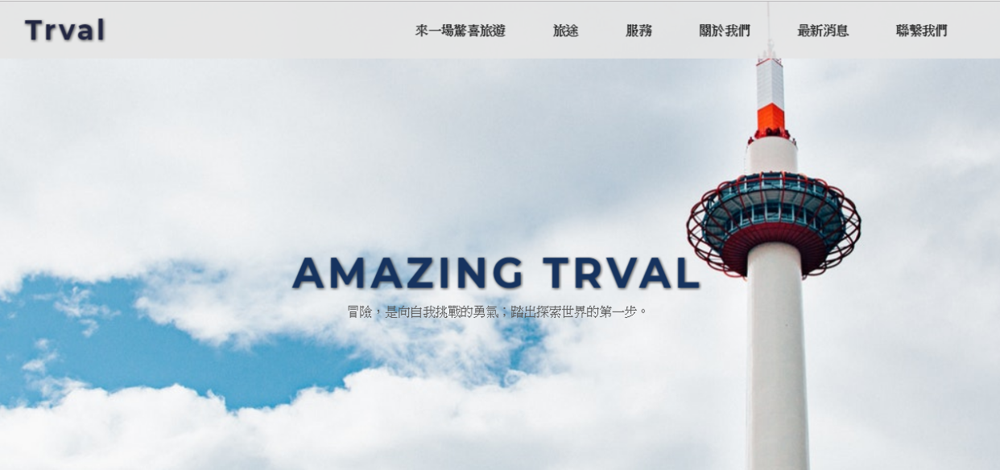

# 陳世勛 (Joe Chen) 
- Birthday: 1993/07/30
- Education:景文科技大學 / 電子工程系
- Location: New Taipei City
- E-mail: yes852956@gmail.com
- Mobile: 0937-791-264
- 線上技術及心得筆記本 : https://medium.com/joelifestory (會漸漸從原本 Evernote 轉移心得及筆記至 Medium)

### 專業技能
- 熟悉 Vue 前端框架並搭配bootstrap做開發，將前後端分離，並達成 SPA 的概念。
- 熟悉 Javascript ES6、ES5語法。
- 熟悉 jQuery Plugin 整合第三方插件動畫效果
- 熟悉 Bootstrap 快速開發響應式網頁並且客製Bootstrap元件內容達到客戶想要的樣式。
- 熟悉 Git 做版本控制。
- 熟悉 HTML5 : 熟悉應用HTML標籤，熟悉如何切版且不依賴Bootstrap切出客戶需求的頁面
- 熟悉 CSS : 熟悉排版 了解如何正確使用display(grid、flex、position、z-index、box-model、grid),熟悉pseudo element
- 熟悉 Sass / SCSS : 將重用性的CSS模組化，加速開發並提高維護性
- 熟悉 響應式網頁(RWD) : 熟悉可不依賴套件並手刻切版；手機、平板、桌電三種適用的頁面
- 使用 Git / Git GUI 做版本控制
- 使用 AJAX , Promise(Axios套件) 撈取遠端後端資料並渲染在網頁上、透過AJAX使用RESTful理念操作。
- 使用 D3.js 及 C3.js 繪製各式動態圖表
- 使用 Gulp,Webpack 壓縮檔案並提高網頁效率。
- 使用 Photoshop 進行視覺流程製作，並將圖檔壓縮及改為SVG，提高載入效率。
- 使用過多種Plugin 搭配網頁達到多種特效，加速網頁開發
* 了解SEO搜尋引擎優化；建立有效率且易維護的程式碼；了解相容性；有良好習慣性的註解以便維護及修改
* CSS Style遵循 (OOCSS、BEM 之風格)，以便利後續維護及重複使用性

### 工作經驗 

-  工作期間 2018/03 - 2019/05 慕恩創意行銷網頁設計公司  
   職位:前端工程師 
   * 多種活動網站
     * 優化效能 - 提升網頁載入時間 
     * FB追蹤、Google追蹤 - 點擊及轉換
     * 客製化響應式介面
   * 形象網站
     * 優化效能 - 模組共用 / 提昇網頁載入時間 / 提升維護品質 
     * 善用 Plugin，達到多種特效
     * 與 designer 共同討論版型、特效及 UI/UX 效果及流程 
   * 維護舊有網站及備份資料
-  工作期間 2012 - 2017 全家便利商店 直營店 
   職位:副店長 
-  工作期間 2014 - 2015 麥當勞 直營店 
   職位:工讀生 

### 作品集 
 # 匯率兌換網站 (Vue-Eate) 
 - <a href="https://joechen0730.github.io/Vue-Eate/" target="blank"><B>匯率兌換網站</B> (RWD)</a>  
   <a href="https://joechen0730.github.io/Vue-Eate/" target="blank"> </a>  
    
   ⌞使用 Vue cli3 ，並用 i18n 支持多語言（中 / 英) 。 
   ⌞ 使用 MVVM 資料綁定的方式，可在下方表格輸入貨幣金額並且立馬轉換。 
   ⌞ 透過 node.js 線上資料庫每日抓取新 API資料  
   ⌞ 動態偵測網址切換後可直接更改語系(Tw or En)  
   ⌞ 匯率兌換時，透過參數將值放置網址並且編碼傳送至兌換頁面，重整後解析一樣可得相同數值 
   ⌞ 使用 Google Analytics 來追蹤網站成效，並且設定轉換率確認使用者停留頁面等等事件 
   ⌞ 使用 vue-router 製作 SPA 網站  
   ⌞ 與<a href="https://github.com/Mix-Liten" target="blank"> Mix-Liten </a>好友透過 Git 共同完成。
    
 # 高雄旅遊資訊 (Kaohsiung-Travel)
 - <a href="https://joechen0730.github.io/kaohsiung-travel/" target="blank"><B>高雄旅遊資訊</B> (RWD)</a>  
   <a href="https://joechen0730.github.io/kaohsiung-travel/" target="blank"> </a>  
  
  ⌞ 使用 Vue 框架完成，再資料獲取完及運算後渲染至頁面。 
  ⌞ 透過 AJAX 技術(Axios) 取得 Json 資料。 
  ⌞ 做出彈跳視窗，將你所點選該地區的資料透過Vue存取資料後並顯示該當地區域的資訊。 
  ⌞ 動態取得點擊資訊，將資料透過 computed 將緩存應用，提升使用者瀏覽體驗。 
  
 # 台灣天氣圖 (Taiwan-weather)
 - <a href="https://joechen0730.github.io/Taiwan-weather/" target="blank"><B>Taiwan Weather</B></a>  
   <a href="https://joechen0730.github.io/Taiwan-weather/" target="blank"> </a> 
   <a href="https://joechen0730.github.io/Taiwan-weather/" target="blank"> </a>  
   ⌞ 使用 Vue.js 資料驅動畫面並且動態抓取背景圖及資料 
   ⌞ D3.js 搭配 topojson.js 繪製台灣地圖 
   ⌞ 使用 c3.js 搭配 Axios 動態取得預測天氣，並渲染到頁面上 
   ⌞ Support for more than tablet (最低支援到平板以上) 
  
# Vuex備忘錄 (Vuex-todolist)
- <a href="https://joechen0730.github.io/Vuex-todolist/" target="_blank"><B>Vuex-todolist</B> (RWD)</a>  
  <a href="https://joechen0730.github.io/Vuex-todolist/" target="_blank"> </a>  
  
  ### 可雙擊後修改資料，並且加上時間戳來顯示上次新增時與現在的時間差  
  <a href="https://joechen0730.github.io/Vuex-todolist/" target="_blank">       </a> 
     
  ⌞ 使用 Vue cli3 ，並用 Vuex store 將資料集中管理。 
  ⌞ 使用 router 偵測路由狀況及獲取資料。 
  ⌞ 透過 localStoge 將資料儲存在本地端網頁中，使下次開網頁時並不會被清空。 
  ⌞ 將資料透過 computed 暫存，優化網頁速度及運算時間。 
  ⌞ 做出時間差模組，可得知當下發文時間及當前時間相差多少 Ex: fb 時間戳，IG時間戳 等等．．。   
       
- <a href="https://joechen0730.github.io/Joe-shop/" target="blank"><B>Joe's Shop 電子商務網站(RWD)(多頁式) </B> </a>  
   
  ⌞ Bootstrap並修改部分Bootstrap原件建立獨一無二的網站(RWD) 。  
  ⌞ 在商品頁中加入燈箱，使購買者放大商品，提高購買者的購買慾望 
  ⌞ 加入切換照片的功能，使購買者可選擇不同顏色的服務 
  ⌞ 表單設立前端網站的驗證功能，可先偵測表單是否正確。 
  ⌞ 加入購物車及登入、註冊之功能。 
  ⌞ 主頁、商品頁、結帳頁都擁有RWD，在較小的頁面中，提高UX的體驗性，將按鈕及商品、文字皆放大，創造大眾電子商務無 RWD 之功能 
  ⌞ *輪播圖片擷取自蝦皮拍賣，此網站僅供自己練習及投遞履歷使用，無任何商業及營利之行為。 
   
- <a href="https://joechen0730.github.io/diner/" target="blank"><B>大堡一餐 diner(RWD) </B> </a>  
  <a href="https://joechen0730.github.io/diner/" target="blank"> </a> 
 
  ⌞ Bootstrap 快速搭建響應式網頁 + RWD 。  
  ⌞ 加入進場特效使顧客有不同的使用體驗 
  ⌞ 使用視差滾動呈現前後漸層效果 
  ⌞ 結合 Google Map Api 將資料標記在地圖上。 
  ⌞ 透過多方參考，並自行設計UI/UX界面。 

- <a href="https://joechen1.000webhostapp.com/bmi/" target="blank"><B>健康小檢驗-算算 BMI </B> </a>  
    
     
  ⌞ 透過 Javascript 實現數學計算、並擁有 Todo-list (新增、完成與刪除事件)   
  ⌞ 根據輸入不同的資料，給予不同顏色條的 BMI 作為回復 
  ⌞ 使用網頁暫存將資料暫存在網頁中，需要手動刪除才可將資料移除。 

- <a href="https://joechen0730.github.io/trvaltime/"><B>驚奇旅遊</B> (RWD)</a>  
  <a href="https://joechen0730.github.io/trvaltime/"> </a> 
  ⌞ 建立三種大眾常用的響應式網頁(手機、平板、桌電)  
  ⌞ 使用多種動畫進場特校 
  ⌞ 加入輪播及位置條，在不同的區塊，位置條會顯示所在的區域 
    
- <a href="#" target="blank"><B>Jos's形象網站 (建置中尚未完成)</B></a> 
   
 
   ⌞ 使用 SCSS 及 Webpack 提高網頁效率及程式碼整潔 
   ⌞ 使用 視差滾動來達成用戶良好的 UX體驗 
   ⌞ 加入多種炫麗特效及網頁特效，提升網頁質感 
   ⌞ 在較小的裝置中，使用左側滑入的導覽列。 
   ⌞ (預計)將網頁做成專業的形象網站，讓用戶有良好的操作體驗及感官，加深對於此形象網站的好感 
